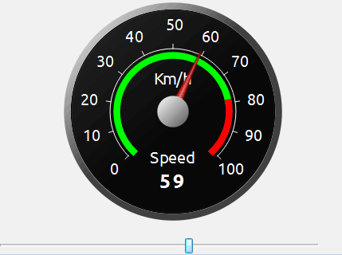
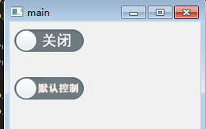
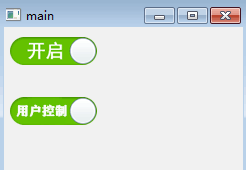

=======
## QFreamWok 文件是一套通用的Qt程序开发框架，采用C++编写，使用时直接添加进项目文件中。
* ### (1).QMeter类为汽车仪器仪表类
    
    * 使用方式：
    ```c++
    QMeter *m_pMeter = new QMeter(this);
    m_pMeter->setGeometry(0,0,434,282);
    m_pMeter->setForeground(Qt::white);
    m_pMeter->setFont(QFont("Ubuntu",5));

    QSlider *m_pSlider1 = new QSlider(this);
    m_pSlider1->setGeometry(500,300,400,20);
    m_pSlider1->setOrientation(Qt::Horizontal);

    connect(m_pSlider1,SIGNAL(sliderMoved(int)),m_pMeter1,SLOT(setValue(int)));
    ```
* ### (2).SwicthButton为开关切换状态类
    
      
    * 使用方式：
    ```c++
    m_RedSwitchbtn = new SwitchButton(m_pPlot);
    m_RedSwitchbtn->setImage(":/image/btncheckoff7.png",":/image/btncheckon7.png");
    m_RedSwitchbtn->move(510,220);
    m_RedSwitchbtn->setButtonStyle(SwitchButton::ButtonStyle_Image);
    ```
* ### (3). AnimationButton 为动画按钮类
<br>
    <br>* 使用方式：
   ```c++
   	 AnimationButton *animationbutton = new AnimationButton(this);
   	 animationbutton->setText("主页");
	animationbutton->setImage(":/image/v-home-ico-home.png");
    	connect(animationbutton,SIGNAL(clicked()),this,SLOT(slot_switchbutton()));
    ```
* ### (4). 添加uidemo18 刘大师通用导航界面
<br>
